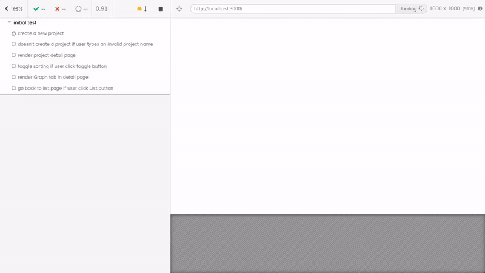

# Bugcide (Client & Server & Npm Module & Webpack Plugin)

## Introduction
**Bugcide**는 프론트엔드 개발을 하는 도중에 발생하는 에러를 수집하여 기록해주는 에러 트래킹 모듈입니다. 지원하는 개발 언어는 JavaScript로 Vanilla JavaScript와 React 개발 환경을 지원합니다. 아래의 Installation 가이드대로 설치 후 실행하면 프론트엔드 개발 시 발생하는 모든 에러를 감지하여 프로젝트별로 에러 로그를 관리해줍니다.
**Bugcide** is a JavaScript error tracking solutions. It captures any uncaught errors, report errors, and log messages.

## Preview
**배포 링크**:
- Client: [https://www.bugcide.live](https://www.bugcide.live)
- Npm Module: [https://www.npmjs.com/package/bugcide](https://www.npmjs.com/package/bugcide)
- Webpack Plugin: [https://www.npmjs.com/package/bugcide-webpack-plugin](https://www.npmjs.com/package/bugcide-webpack-plugin)


## Features
- GitHub 소셜 로그인
- Npm Module과 Webpack Plugin 지원
- Browser 에러 및 Webpack Compile 에러 감지 및 수집
- 프로젝트별 에러 관리
- 시간대별 에러 타임라인 보기 제공
- 최신순 및 역순 정렬 가능
- 에러 타임라인 페이지네이션 기능
- 발생한 에러 메시지로 Google 및 Stack Overflow 검색 기능
- 시간대별 에러 발생량 라인 차트 제공
- 에러 타입별 버블 차트 제공
- Browser 에러 연속 발생 시 console 창에 응원 메시지 출력

## Requirements
- 로그인 시 사용자 GitHub 계정 필요
- ES2015+ 지원 최신 Chrome Browser 권장

## Prerequisites
### Client
Bugcide Client는 Firebase SDK로 GitHub 로그인을 구현했습니다.  
따라서 로컬에서 실행하기 위해서는 아래 과정이 선행되어야 합니다.

1. 아래 링크를 클릭하여 1단계와 2단계를 진행합니다.  
[Click Here](https://firebase.google.com/docs/web/setup?hl=ko)
2. 1번을 진행하고 얻은 Firebase 구성 객체의 항목들과 서버 주소를 `.env` 파일에 다음과 같이 추가합니다.
```
REACT_APP_FIREBASE_API_KEY=<api-key>
REACT_APP_FIREBASE_AUTH_DOMAIN=<project-id>.firebaseapp.com
REACT_APP_FIREBASE_DATABASE_URL=https://<project-id>.firebaseio.com
REACT_APP_FIREBASE_PROJECT_ID=<project-id>
REACT_APP_FIREBASE_STORAGE_BUCKET=<project-id>.appspot.com
REACT_APP_FIREBASE_MESSAGING_SENDER_ID=<sender-id>
REACT_APP_FIREBASE_APP_ID=<app-id>
REACT_APP_SERVER_URL=http://localhost:8080
```
3. 아래 링크를 클릭하여 '시작하기 전에' 파트를 2번부터 진행합니다.  
[Click Here](https://firebase.google.com/docs/auth/web/github-auth?hl=ko)

### Server
`.env` 파일을 생성하여 다음과 같이 환경변수를 입력한 후 저장합니다.  
<>를 제거하고 사용자의 MongoDB Connection String과 Jwt Secret Key로 사용할 String을 입력해주세요.
```
PORT=8080
MONGODB_ATLAS_URL=<mongoDB-connection-string>
JWT_SECRET_KEY=<jwt-secret-key>
```

## Installation
### Client
```
git clone https://github.com/jy7123943/bugcide_client.git
cd bugcide_client
# 위에서 생성한 .env 파일을 Root 디렉토리에 추가
npm install
npm start
```

### Server
```
git clone https://github.com/jy7123943/bugcide_server.git
cd bugcide_server
# 위에서 생성한 .env 파일을 Root 디렉토리에 추가
npm install
npm start
```

### Npm Module & Webpack Plugin
사용자의 Vanilla JavaScript 혹은 React 프로젝트에 Bugcide를 적용하려면 다음과 같은 과정이 필요합니다.
1. 위에서 실행한 혹은 배포된 [Bugcide Client](https://www.bugcide.live) 로그인
2. 새 프로젝트를 생성하여 프로젝트 토큰 발급
3. 아래 가이드를 참고하여 Bugcide 설치 및 적용

Getting started with Bugcide is a three step process:
1. [Bugcide Login](https://www.bugcide.live)
2. Create a new project and get a Project Token
3. Follow the directions below to install Bugcide

#### For React.js
1. [`bugcide`](https://www.npmjs.com/package/bugcide), [`bugcide-webpack-plugin`](https://www.npmjs.com/package/bugcide-webpack-plugin) 설치
```
npm install bugcide bugcide-webpack-plugin --save-dev
```

2. index.js
```javascript
import React from 'react';
import { render } from 'react-dom';
import App from './src/App';
import Bugcide from 'bugcide';

new Bugcide().init({ projectToken: <your-project-token> });

render(<App />, document.getElementById('root'));
```

3. webpack.config.js
Create React App으로 생성하여 eject한 리액트 앱은 정식으로 지원하지 않기 때문에 정상적으로 작동하지 않을 수 있습니다.
```javascript
const bugcidePlugin = require('bugcide-webpack-plugin');

module.exports = {
  ...
  plugins: [
    ...
    new bugcidePlugin({
      projectToken: <your-project-token>
    })
  ]
};
```

#### For Vanilla JavaScript
1. jsDelivr CDN 이용 또는 [GitHub](https://github.com/jy7123943/bugcide_npm_package)에서 bugcide.vanilla.js 다운로드
```javascript
<script src="https://cdn.jsdelivr.net/npm/bugcide@1.0.4/dist/bugcide.vanilla.js"></script>
<script src="https://cdn.jsdelivr.net/npm/bugcide@1.0.4/dist/bugcide.vanilla.min.js"></script> // minified version
```
2. 아래 코드 추가
```javascript
<script src="https://cdn.jsdelivr.net/npm/bugcide@1.0.4/dist/bugcide.vanilla.js"></script>
<script>
  new Bugcide().init({ projectToken: <your-project-token> });
</script>
```

## Skills
### Client
- ES2015+
- React
- Redux
- React Router
- Firebase Authentication
- D3.js for Visualization
- Sass

### Server
- ES2015+
- Node.js
- Express
- JSON Web Token Authentication
- MongoDB, Atlas
- Mongoose

### Npm Module & Webpack Plugin
- ES2015+

## Test
### Client
- Jest, Enzyme for Component & Reducer Unit test
- End To End(E2E) Test with Cypress


### Npm Module & Webpack Plugin
- Mocha, Chai, Sinon for Unit test

## Project Control
- Git, GitHub
- Trello를 이용한 Task 일정 관리

## Deployment
### Client
- Netlify
- Custom Domain

### Server
- Amazon Web Services(AWS) Elastic Beanstalk
- Circle CI를 이용한 빌드 자동화
- Custom Domain

### Npm Module & Webpack Plugin
- Npm

## Challenges
- 처음에는 웹 브라우저에서 발생하는 에러만 감지하면 React 프로젝트에서 발생하는 모든 에러를 추적할 수 있으리라 생각했습니다. 그러나 React 환경에서는 대부분의 Syntax 에러가 Webpack Compile 단계에서 발생하여 에러가 감지되지 않는 문제점이 있었습니다. Compile 단계의 에러를 감지하기 위해 여러 방법을 모색하다가 Webpack Plugin을 만들어 해결하였습니다.
- 에러 상황을 시각화하기 위해 Chart.js 라이브러리를 사용하려고 했으나 좀 더 화려한 애니메이션 효과를 넣기 위해 D3.js를 사용하여 시각화하였습니다. 사용하는 방법이 까다로워 애니메이션 효과를 넣는 것에 어려움이 있었으나 좀 더 시각적으로 보기 좋은 차트를 그릴 수 있었습니다.
- 여러 개의 에러가 동시다발적으로 발생하는 경우를 대비하여 에러가 발생할 때마다 서버에 요청 보내는 것을 개선하기 위해 고민하였습니다. 에러 발생 시 2초 동안 추가로 발생하는 에러를 배열에 저장하였다가 한꺼번에 서버로 전송하는 방향으로 리팩토링하였습니다. 또한 한 배열에 동일한 에러 객체가 연속적으로 저장된 경우에는 하나의 에러 객체로 압축하여 서버에 전송하는 데이터의 양을 절감하였습니다. 결과적으로 이전보다 서버 Api 호출 횟수와 서버로 전송되는 데이터의 양을 약 2배 정도 줄일 수 있었습니다.

## Things to do
- Node.js 환경에서의 서버 에러 트래킹 기능
- 일자별 에러 발생량 차트 추가
- 에러 즐겨찾기 기능
- 에러별 사용자 메모 작성 및 저장 기능
- 프로젝트 및 에러 검색 기능
- Server Api Unit Test
